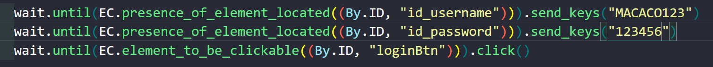
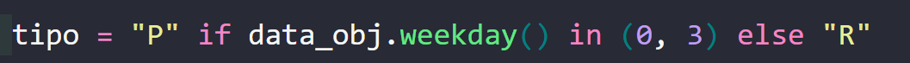

# 📌 Automação Selenium – Lançamento de OS

## Este projeto automatiza o processo de login e lançamento de Ordens de Serviço (OS) no sistema da agenda, utilizando Selenium WebDriver.

---

# 🔐 1. Login no Sistema

## O acesso ao sistema é feito automaticamente pelo script através dos campos de autenticação.

## 📍 Código responsável:

⚠️ Observação:

## Essa regra precisa ser ajustada conforme o usuario digitando usuario e senha  ela pode ser alterada diretamente no código:

## 🧠 Como funciona:
## O campo id_username recebe o nome de usuário do sistema
## O campo id_password recebe a senha de acesso
## O método send_keys() simula a digitação automática no navegador
# ⚠️ Importante:

## As credenciais estão fixas no código e devem ser alteradas conforme o usuário que for executar a automação

# 📅 2. Regra de Dias Presenciais (Tipo de Atendimento)

## O sistema define automaticamente o tipo de atendimento como Presencial (P) ou Remoto (R) com base no dia da semana da OS.

# 📍 Trecho do código:

# 🧠 Como funciona:

## O método weekday() retorna o dia da semana em formato numérico:

| Dia da semana | weekday() |
| ------------- | --------- |
| Segunda-feira | 0         |
| Terça-feira   | 1         |
| Quarta-feira  | 2         |
| Quinta-feira  | 3         |
| Sexta-feira   | 4         |
# 📊 Regra atual:
## Se weekday() for 0 ou 3 → Presencial (P) Caso contrário → Remoto (R)
# ⚠️ Observação:

## Essa regra precisa ser ajustado  conforme o usuario . Caso necessário, ela pode ser alterada diretamente no código: